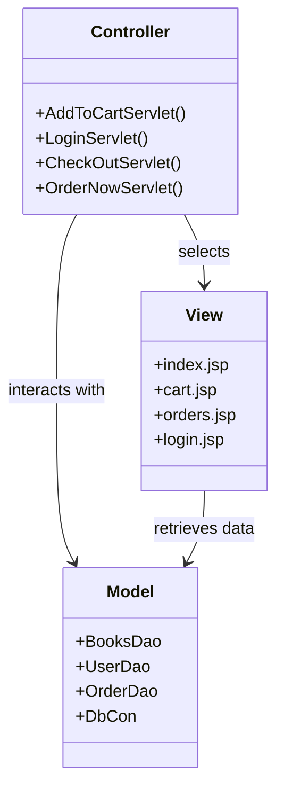

```markdown
# E-Commerce Bookstore System Report

## 1. Introduction
This report provides an in-depth analysis of the design, development, and implementation of a robust e-commerce web application for an online bookstore. Leveraging core Java technologies including Servlets, JSP, and JDBC, the system facilitates a complete online shopping experience. Users can register, securely log in, browse an extensive catalog of books, manage their shopping cart, place and track orders, and review purchase history. The application features a modern, responsive UI and strictly adheres to the MVC architectural pattern.

## 2. Project Objectives
- **Responsive UI**: Seamless experience across devices
- **Secure Authentication**: Robust user registration/login mechanisms
- **Book Management**: Effortless browsing with categorization
- **Cart Functionality**: Dynamic add/update/remove operations
- **Order Processing**: Complete order lifecycle management
- **Backend Robustness**: Efficient database integration via JDBC

## 3. Technology Stack
| Layer        | Technologies                          |
|--------------|---------------------------------------|
| **Frontend** | CSS, Bootstrap 5, JSP with JSTL      |
| **Backend**  | Java, Jakarta EE Servlets, JDBC      |
| **Database** | MySQL 8.0+                           |

## 4. System Architecture (MVC Pattern)


## 5. Database Design
**Key Tables:**
- `users` (id, name, email, phone, password)
- `products` (id, name, price, category, image)
- `orders` (o_id, p_id, u_id, o_quantity, o_date)

**Connection Management:**
```java
public class DbCon {
    private static Connection connection = null;
    
    public static Connection getConnection() throws ClassNotFoundException, SQLException {
        if(connection == null || connection.isClosed()) {
            Class.forName("com.mysql.cj.jdbc.Driver");
            connection = DriverManager.getConnection(
                "jdbc:mysql://localhost:3306/ecommerce_cart", 
                "root", "12345678"
            );
        }
        return connection;
    }
}
```

## 6. Functional Modules
### 6.1 User Authentication
- `RegisterServlet`: Handles user registration
- `LoginServlet`: Manages credential verification
- `LogoutServlet`: Terminates sessions securely

### 6.2 Book Management
- `BooksDao.getAllBooks()`: Retrieves all products
- Displayed on `index.jsp` with images/categories

### 6.3 Shopping Cart
- Session-managed using `cart-list` attribute
- Servlets: 
  - `AddToCartServlet`
  - `RemoveFromCartServlet`
  - `QuantityIncDecServlet`

### 6.4 Order Processing
- `CheckOutServlet`: Processes full cart checkout
- `OrderNowServlet`: Direct single-item ordering
- `CancelOrderServlet`: Manages order cancellations

## 7. Core Code Highlights
### 7.1 Book Retrieval (BooksDao.java)
```java
public List<Books> getAllBooks() {
    List<Books> books = new ArrayList<>();
    String query = "SELECT * FROM products";
    // Execute query and populate books list
    return books;
}
```

### 7.2 User Login (UserDao.java)
```java
public User userLogin(String email, String password) {
    String query = "SELECT * FROM users WHERE email=? AND password=?";
    try (PreparedStatement pst = this.con.prepareStatement(query)) {
        pst.setString(1, email);
        pst.setString(2, password);
        // Process result set
    }
    return user;
}
```

### 7.3 Order Placement (OrderDao.java)
```java
public boolean insertOrder(Order model) {
    String query = "INSERT INTO orders (p_id, u_id, o_quantity, o_date) VALUES (?,?,?,?)";
    try (PreparedStatement pst = this.con.prepareStatement(query)) {
        pst.setInt(1, model.getId());
        pst.setInt(2, model.getUid());
        pst.setInt(3, model.getQuantity());
        pst.setString(4, model.getDate());
        return pst.executeUpdate() > 0;
    }
}
```

## 8. UI/UX Features
- **Glassmorphism Design**: Frosted glass effects with transparency
- **Responsive Layout**: Bootstrap 5 for cross-device compatibility
- **Dynamic Navigation**: Context-aware menu items
- **Key Pages**:
  - Home (`index.jsp`)
  - Cart (`cart.jsp`)
  - Orders (`orders.jsp`)
  - Authentication (`login.jsp`, `register.jsp`)

## 9. Security Measures
- `HttpSession` for user state management
- `PreparedStatement` for SQL injection prevention
- Basic server-side input validation
- **Production Recommendations**:
  - Implement password hashing (BCrypt)
  - Enforce HTTPS encryption
  - Add CSRF protection

## 10. Testing Coverage
| Module                  | Test Cases                     |
|-------------------------|--------------------------------|
| User Authentication     | Valid/invalid credentials      |
| Cart Management         | Add/update/remove operations  |
| Order Processing        | Placement/cancellation flows  |
| Database Operations     | CRUD validation               |

## 11. Future Improvements
1. Admin dashboard for inventory management
2. Payment gateway integration (Stripe/PayPal)
3. Advanced search/filter functionality
4. Automated testing with JUnit/Selenium
5. Password hashing implementation
6. Email verification system
7. Database connection pooling

## 12. Conclusion
This Java-based e-commerce system demonstrates effective implementation of MVC architecture using Servlet technology and MySQL. The solution provides core bookstore functionality with a modern UI while maintaining separation of concerns. Future enhancements will focus on security hardening and payment integration to transition into a production-ready platform.
```
